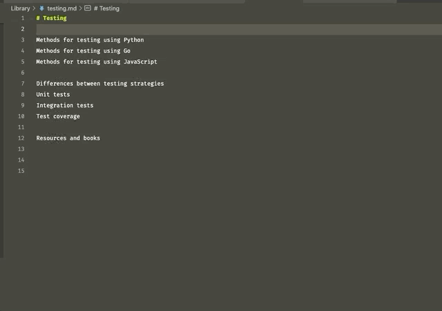

# add-double-bracket-notation README

[Foam](https://foambubble.github.io/) is an excellent personal knowledge management and sharing system inspired by [Roam Research](https://roamresearch.com/), built on [Visual Studio Code](https://code.visualstudio.com/) and [GitHub](https://github.com/).

You link documents together in Foam using **[[wiki-links]]**, and use these links to navigate between them to explore your knowledge graph. Foam's shortcuts and autocompletions automatically generate new, blank documents for you corresponding to new **[[wiki-links]]** in the file you've just saved. 

I've found that when sketching out new projects and areas to study and research, I'll often need to convert lists of topics within information I've cut-and-paste to **[[wiki-links]**], which can be tedious to do manually. 

This VS Code extension allows you to select one or more lines of text and quickly and easily re-format each line within brackets, so that Foam can then create them as proper [[wiki-links]] with the associated placeholder files upon saving.

The extension will only format lines with text within the selection; blank lines are left unformatted.

## Features

1. Select one or more lines of text

2. Within **Command Palette** (`⇧⌘P` on macOS, `Ctrl+Shift+P` on Windows), select **Add Double Bracket Notation to Selection**

3. Each line of text is formatted surrounded by double brackets:

4. Foam generates a placeholder file and records the link for each formatted [[wiki-link]]

## License

MIT License

## Requirements

This extension was developed against Visual Studio Code version 1.52. It may work with earlier versions.

There are no other specific requirements or dependencies needed. This extension merely adds the double bracket notation to the text; you would need [Foam](https://foambubble.github.io/) and its suite of [recommended supporting extensions](https://foambubble.github.io/foam/recommended-extensions) installed to actually have these used as links.

## Known Issues

No known issues. Please let me know if you experience any issues.

## 1.0.0

Initial release of **add-double-bracket-notation**
